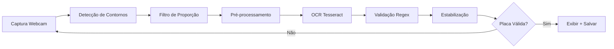

# 🚗 Sistema de Reconhecimento de Placas em Tempo Real

[](https://www.python.org/)
[](https://opencv.org/)
[](https://streamlit.io/)
[](LICENSE)

Sistema inteligente de detecção e reconhecimento automático de placas veiculares brasileiras utilizando **Visão Computacional** e **OCR** (Optical Character Recognition).

<div align="center">
  
  
</div>

---

##  Sobre o Projeto

Este sistema captura vídeo em tempo real através da webcam, detecta automaticamente regiões candidatas a placas veiculares, extrai os caracteres usando OCR e valida o formato das placas brasileiras (padrões antigo **AAA9999** e Mercosul **AAA9A99**).

###  Características Principais

-  **Captura em tempo real** via webcam
-  **Detecção automática** usando análise de contornos
-  **Pré-processamento avançado** (CLAHE, filtros bilaterais, binarização OTSU)
-  **OCR otimizado** com Tesseract
-  **Validação inteligente** de placas brasileiras
-  **Sistema de estabilização** anti-falsos positivos
-  **Salvamento automático** de capturas com timestamp
-  **Exibição de FPS** em tempo real
-  **Duas interfaces disponíveis**: OpenCV e Streamlit

---

##  Versões Disponíveis

###  Versão OpenCV (Desktop)
**Arquivo:** `car_plate_recognition.py`

Interface tradicional com janela OpenCV, ideal para:
- ✅ Melhor performance
- ✅ Baixa latência
- ✅ Processamento local otimizado
- ✅ Controle total via teclado (ESC para sair)

###  Versão Streamlit (Web)
**Arquivo:** `car_plate_recognition_streamlit.py`

Interface web moderna e interativa, ideal para:
- ✅ Acesso via navegador
- ✅ Interface amigável
- ✅ Fácil compartilhamento
- ✅ Deploy simplificado

---

## 🛠️ Tecnologias

| Tecnologia | Versão | Função |
|-----------|--------|--------|
| **Python** | 3.8+ | Linguagem base |
| **OpenCV** | 4.8.1 | Processamento de imagens |
| **Pytesseract** | 0.3.10 | OCR engine |
| **NumPy** | 1.24.3 | Operações matemáticas |
| **Streamlit** | 1.28.1 | Interface web |
| **Pillow** | 10.1.0 | Manipulação de imagens |

---

##  Pré-requisitos

### 1. Python 3.8+
```bash
python --version
```

### 2. Tesseract OCR

**Windows:**
1. Baixe o instalador: [Tesseract GitHub](https://github.com/UB-Mannheim/tesseract/wiki)
2. Instale (normalmente em `C:\Program Files\Tesseract-OCR\`)
3. Configure o caminho no script

**Linux (Ubuntu/Debian):**
```bash
sudo apt update
sudo apt install tesseract-ocr tesseract-ocr-por
```

**macOS:**
```bash
brew install tesseract
```

### 3. Webcam
Webcam funcional conectada ao computador

---

##  Instalação

### 1️⃣ Clone o repositório
```bash
git clone https://github.com/seu-usuario/reconhecimento-placas.git
cd reconhecimento-placas
```

### 2️⃣ Crie um ambiente virtual
```bash
# Windows
python -m venv venv
venv\Scripts\activate

# Linux/macOS
python3 -m venv venv
source venv/bin/activate
```

### 3️⃣ Instale as dependências
```bash
pip install -r requirements.txt
```

### 4️⃣ Configure o Tesseract

**Edite o script escolhido e ajuste o caminho:**

```python
# Windows
pytesseract.pytesseract.tesseract_cmd = r"C:\Program Files\Tesseract-OCR\tesseract.exe"

# Linux/macOS (geralmente não precisa ajustar)
# pytesseract.pytesseract.tesseract_cmd = r"/usr/bin/tesseract"
```

---

##  Como Usar

###  Versão OpenCV (Recomendada)

```bash
python car_plate_recognition.py
```

**Controles:**
- **ESC** - Encerrar o programa
- A janela abre automaticamente
- Posicione uma placa na frente da câmera
- Detecções são salvas em `captures/`

**Capturas salvas:**
```
captures/
├── plate_ABC1234_20251120_143052.png
├── plate_XYZ5A67_20251120_143125.png
└── ...
```

###  Versão Streamlit

```bash
streamlit run car_plate_recognition_streamlit.py
```

A interface web abrirá automaticamente no navegador em `http://localhost:8501`

---

##  Funcionamento



###  Pipeline de Processamento

1. **Captura** - Frame da webcam (640x480)
2. **Detecção** - Análise de bordas (Canny) + contornos retangulares
3. **Filtragem** - Aspect ratio entre 2.0 e 6.5 (típico de placas)
4. **Pré-processamento:**
   - CLAHE (melhora contraste adaptativo)
   - Bilateral Filter (reduz ruído)
   - Binarização OTSU
   - Morfologia (fechamento)
5. **OCR** - Tesseract com PSM 7 (linha única)
6. **Validação** - Regex para placas BR: `[A-Z0-9]{5,8}`
7. **Estabilização** - 3 frames consecutivos iguais
8. **Saída** - Exibição + salvamento com timestamp

---

##  Configurações Avançadas

### Ajustar Detecção

**No arquivo `car_plate_recognition.py`:**

```python
# Tamanho mínimo da placa (pixels)
if w < 60 or h < 15:  # Ajuste conforme sua câmera
    continue

# Proporção largura/altura (aspecto)
if 2.0 < aspect_ratio < 6.5:  # Ajuste para placas diferentes
    
# Detecção de bordas
cv2.Canny(gray, 100, 200)  # Valores de threshold

# Estabilização (frames necessários)
if text_counter >= 3:  # Aumente para mais estabilidade
    stable_text = cleaned
```

### Desativar Salvamento

```python
SAVE_CAPTURES = False  # Não salvar capturas
```

### Mudar Diretório

```python
CAPTURE_DIR = "minhas_capturas"  # Personalizar pasta
```

---

##  Desempenho

| Métrica | Valor |
|---------|-------|
| **FPS Típico** | 15-30 (hardware dependente) |
| **Taxa de Detecção** | ~85-95% (condições ideais) |
| **Latência** | <100ms por frame |
| **Resolução** | 640x480 (otimizada) |

**Condições ideais:**
- ✅ Boa iluminação
- ✅ Placa limpa e visível
- ✅ Distância de 0.5-2 metros
- ✅ Placa perpendicular à câmera

---

##  Solução de Problemas

###  Erro: "Não foi possível abrir a webcam"

```python
# Tente outros índices
cap = cv2.VideoCapture(1)  # Teste 0, 1, 2...

# Verifique as câmeras disponíveis
import cv2
for i in range(5):
    cap = cv2.VideoCapture(i)
    if cap.isOpened():
        print(f"Câmera {i} disponível")
        cap.release()
```

###  OCR não reconhece

**Soluções:**
- ✅ Verifique instalação do Tesseract
- ✅ Melhore a iluminação
- ✅ Aproxime/afaste a placa (teste distâncias)
- ✅ Limpe a lente da câmera
- ✅ Reduza tremores (fixe a câmera)

###  Muitos falsos positivos

```python
# Aumente a estabilização
if text_counter >= 5:  # Era 3, agora 5

# Refine o tamanho mínimo
if w < 80 or h < 20:  # Mais restritivo

# Ajuste aspect ratio
if 2.5 < aspect_ratio < 5.5:  # Intervalo menor
```

###  Performance baixa

```python
# Reduza resolução
cap.set(cv2.CAP_PROP_FRAME_WIDTH, 480)
cap.set(cv2.CAP_PROP_FRAME_HEIGHT, 360)

# Processe a cada N frames
if frame_count % 2 == 0:  # Pula 1 frame
    continue
```

---

## 📁 Estrutura do Projeto

```
reconhecimento-placas/
│
├── 📄 car_plate_recognition.py          # Script OpenCV
├── 📄 car_plate_recognition_streamlit.py # Script Streamlit
├── 📄 requirements.txt                   # Dependências
├── 📄 README.md                         # Este arquivo
├── 📄 LICENSE                           # Licença MIT
├── 📄 .gitignore                        # Arquivos ignorados
│
├── 📁 captures/                         # Capturas salvas
│   ├── plate_ABC1234_20251120_143052.png
│   └── ...
│
└── 📁 venv/                             # Ambiente virtual
```

---

##  Melhorias Futuras

- [ ]  **Deep Learning** (YOLO/TensorFlow) para maior precisão
- [ ]  **Banco de dados** (SQLite) para histórico
- [ ]  **API REST** (FastAPI) para integração
- [ ]  **Múltiplas câmeras** simultâneas
- [ ]  **Processamento de vídeos** gravados
- [ ]  **Notificações** (Discord/Telegram) em tempo real
- [ ]  **Placas internacionais** (EU, USA)
- [ ]  **Dashboard** com estatísticas
- [ ]  **Docker** para deploy facilitado
- [ ]  **Cloud deploy** (AWS/GCP)

---

## 🤝 Contribuindo

Contribuições são muito bem-vindas! Para contribuir:

1.  Fork o projeto
2.  Crie uma branch (`git checkout -b feature/MinhaFeature`)
3.  Commit suas mudanças (`git commit -m 'Adiciona nova feature'`)
4.  Push para a branch (`git push origin feature/MinhaFeature`)
5.  Abra um Pull Request

**Áreas que precisam de ajuda:**
- Melhorar detecção em baixa iluminação
- Otimização de performance
- Testes automatizados
- Documentação
- Novos algoritmos de OCR

---

##  Licença

Este projeto está sob a licença **MIT**. Veja o arquivo [LICENSE](LICENSE) para mais detalhes.

```
MIT License - Você pode usar, modificar e distribuir livremente
```

---

##  Autor

Desenvolvido como projeto de **Visão Computacional** e **Processamento de Imagens** por José Eduardo, Karla Vitória, João Pedro e Cauã Pereira.

---

##  Agradecimentos

- [OpenCV Community](https://opencv.org/) - Framework de visão computacional
- [Tesseract OCR](https://github.com/tesseract-ocr/tesseract) - Engine de OCR
- [Streamlit](https://streamlit.io/) - Framework web interativo
- Comunidade Python Brasil 🇧🇷

---

##  Contato & Suporte

 **Dúvidas?** Abra uma [Issue](https://github.com/seu-usuario/reconhecimento-placas/issues)

 **Bugs:** Use a aba [Issues](https://github.com/seu-usuario/reconhecimento-placas/issues)

 **Sugestões:** Pull Requests são sempre bem-vindos!

---

<div align="center">

### ⭐ Se este projeto foi útil, considere dar uma estrela! ⭐

**Made with ❤️ and ☕ in Brazil 🇧🇷**

[⬆ Voltar ao topo](#-sistema-de-reconhecimento-de-placas-em-tempo-real)

</div>
